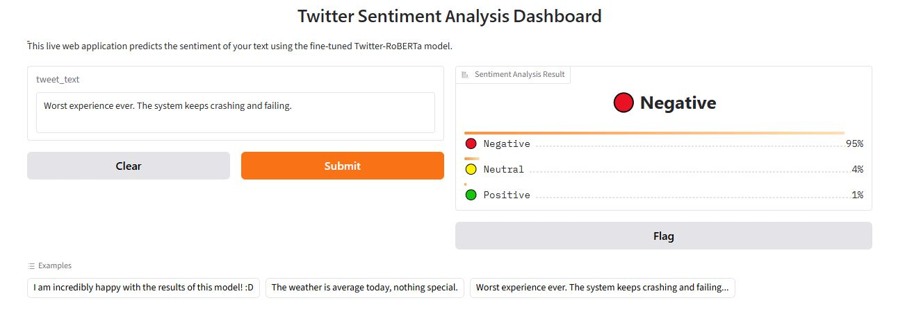

# 🤖 Comparative Benchmark of 7 Transformer Architectures for Twitter Sentiment Analysis

An end-to-end Machine Learning pipeline implemented in PyTorch and Hugging Face to fine-tune, evaluate, and benchmark **7 state-of-the-art Transformer models** on a large-scale dataset of over **45,000 tweets**. This project addresses 3-class sentiment classification (Positive, Neutral, Negative) while solving critical production challenges such as hardware constraints, gradient instability, and failure mode analysis.

---

## 🎯 1. Project Objectives & Goals
* **Comprehensive Benchmarking:** Systematically evaluate and compare baseline, distilled, and domain-specific Transformer architectures on highly informal text.
* **Infrastructure Resilience:** Implement efficient memory management strategies to run deep learning pipelines sequentially without Out-of-Memory (OOM) crashes.
* **Mathematical Optimization:** Analyze and debug training anomalies like numerical explosion and gradient collapse in advanced architectures.
* **Interactive Deployment:** Build and deploy a real-time web interface for live model inference using Gradio.

---

## 📊 2. Dataset Specification & Preprocessing
The model pipeline processes a massive dataset composed of over **45,000 corporate and public tweets**, split hierarchically to ensure rigorous evaluation:
* **Train Set:** 36,492 tweets (80%) — Used for updating model parameters.
* **Dev Set:** 4,561 tweets (10%) — Used for hyperparameter validation and early tracking.
* **Test Set:** 4,562 tweets (10%) — Held out entirely for the final unbiased benchmark.

### Data Format
The script dynamically reads two aligned flat text files:
1. `train_text.txt`: Raw text strings (one tweet per line), containing chaotic structures, slang, hashtags, and emojis.
2. `train_labels.txt`: Corresponding integer targets mapping to:
   * `0`: Negative Sentiment
   * `1`: Neutral Sentiment
   * `2`: Positive Sentiment

---

## 🧠 3. Methodology & Models Evaluated
We evaluate a diverse spectrum of language models to observe how model capacity, distillation, and domain pre-training impact final performance:

1. **`bert-base-cased`:** The classic baseline to evaluate standard masked language modeling.
2. **`cardiffnlp/twitter-roberta-base-sentiment-latest`:** RoBERTa continuously pre-trained on billions of tweets (Domain-Specific).
3. **`distilbert/...-finetuned-sst-2-english`:** A lightweight, distilled model optimized for rapid inference.
4. **`albert/albert-base-v2`:** A parameter-efficient Lite BERT utilizing factorized embedding parameterization.
5. **`vinai/bertweet-base`:** A RoBERTa-style architecture trained specifically on English tweets using a custom RoBERTa tokenizer.
6. **`microsoft/deberta-v3-base`:** An advanced architecture featuring a disentangled attention mechanism and enhanced mask decoder.
7. **`google/electra-base-discriminator`:** Trained using a sample-efficient Replaced Token Detection (RTD) objective as a discriminator rather than a generator.

---

## 📊 4. Benchmark Results & Performance Evaluation

The models were fine-tuned with a learning rate of $2\times10^{-5}$ for 3 epochs using AdamW. The evaluation scores on the completely unseen **Test Set** are summarized below:

| Rank | Model Architecture | Accuracy (Test) | F1-Score (Test) | Precision (Test) | Recall (Test) | Operational Status |
| :---: | :--- | :---: | :---: | :---: | :---: | :---: |
| 🥇 | **Twitter-RoBERTa (CardiffNLP)** | **76.19%** | **74.54%** | **74.72%** | **74.42%** | **Benchmark Winner** |
| 🥈 | **BERTweet (VinAI)** | 75.10% | 73.37% | 73.21% | 73.58% | Outstanding Stability |
| 🥉 | **ELECTRA (Google)** | 73.74% | 71.96% | 71.88% | 72.10% | Optimal Speed/Accuracy |
| 4 | **ALBERT (Lite BERT)** | 72.99% | 71.04% | 71.83% | 70.39% | Extremely Lightweight |
| 5 | **DistilBERT (HuggingFace)** | 72.73% | 70.67% | 71.11% | 70.28% | Fast Inference Baseline |
| 6 | **BERT-Base-Cased (Google)** | 72.05% | 70.22% | 70.15% | 70.32% | Standard Baseline |
| 7 | **DeBERTa-v3 (Microsoft)** | 14.86% | 8.63% | 4.95% | 33.33% | **Failed (NaN Gradient Collapse)** |

---

## 🛠️ 5. Scientific & Engineering Insights

### A. The DeBERTa-v3 Mathematical Failure Case ($NaN$ Loss)
One of the major scientific findings was the absolute collapse of `DeBERTa-v3`. While it routinely beats BERT on standard benchmarks, combining mixed-precision training (`fp16=True`) with DeBERTa’s *Disentangled Attention* layers caused severe numerical underflow/overflow. Gradients exploded instantly in Epoch 1, converting model weights to `NaN` values. The model spent the remaining epochs outputting uniform random guesses (~15% accuracy, exactly `0.3333` macro recall). This highlights that mixed-precision stability requires careful architectural scaling adjustments.

### B. Defensive VRAM Engineering Against Out-of-Memory (OOM)
Sequentially training 7 massive models on a single GPU typically causes memory leaks due to lingering PyTorch execution graphs. To guarantee stable operation, a strict memory evacuation protocol was built into the model-switching loop, manually forcing garbage collection and flushing the CUDA cache:
```python
gc.collect()
torch.cuda.empty_cache()
```

### C. Domain-Specific Tokenization vs. Vanilla Text
Twitter-RoBERTa and BERTweet outclassed all other architectures. This demonstrates that specialized tokenizers (such as Byte-Level BPE trained on social media text) preserve the semantic integrity of emojis, handles, and slang tokens, whereas standard models split them into meaningless sub-words.

##🚀 6. Step-by-Step Execution Guide
The entire end-to-end pipeline is consolidated into a single standalone production script: sentiment_benchmark.py.

###Installation
Install all technical dependencies via pip:

```Bash
pip install torch numpy scikit-learn transformers pandas gradio
```
###File Arrangement
Ensure your workspace directory contains both the Python script and the dataset files:

Plaintext
├── sentiment_benchmark.py
├── train_text.txt
└── train_labels.txt
###Execution
Run the full automated benchmark directly from your terminal:

```Bash
python sentiment_benchmark.py
```
###Pipeline Automation Workflow
When executed, the script automatically steps through the following phases:

###Hardware Validation: Scans and connects to an active CUDA GPU environment.

###Data Pipeline: Loads files, executes an 80/10/10 split, and provisions custom PyTorch Dataset wrappers.

###Sequential Training: Fine-tunes all 7 models, utilizing safe configurations per model type.

###Failure Diagnostics: Performs batched error inferences on the test set and prints a slice of 10 structural misclassifications.

###Gradio Launch: Deploys a live interactive web dashboard loading the champion Twitter-RoBERTa model.

<p align="center">
  
</p>
---

## 👤 Author & Contact

Developed with 💻 by **[Your Name]** Undergraduate Computer Engineering Student

If you have any questions, suggestions, or want to collaborate on similar NLP/ML projects, feel free to reach out!

* **🌐 LinkedIn:** [linkedin.com/in/elhamnasiri](https://linkedin.com/in/elham-nasiri-2bb284358)
* **💻 GitHub Profile:** [@your-github-username](https://github.com/ٍhelishia20)


---

### 📜 License
This project is open-source and available under the **MIT License**. Feel free to fork, modify, and use it in your own projects!
